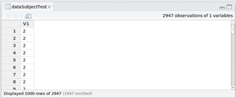

# GettingCleaning

Structure of the data source
----------------------------

1. $home/user/Project_UCI HAR_Dataset/train/subject_train.txt  
2. $home/user/Project_UCI HAR_Dataset/train/y_train.txt  
3. $home/user/Project_UCI HAR_Dataset/train/X_train.txt  

4. $home/user/Project_UCI HAR_Dataset/test/subject_test.txt  
5. $home/user/Project_UCI HAR_Dataset/test/y_test.txt  
6. $home/user/Project_UCI HAR_Dataset/test/X_test.txt  

7. $home/user/Project_UCI HAR_Dataset/features.txt  
8. $home/user/Project_UCI HAR_Dataset/activity_labels.txt  
9. $home/user/Project_UCI HAR_Dataset/features_info.txt  
10. $home/user/Project_UCI HAR_Dataset/README.txt  

Images of the data loaded into memory RStudio  
1 ----------

2 ----------

3 ----------

4 ----------

5 ----------

6 ----------

7 ----------

8 ----------

